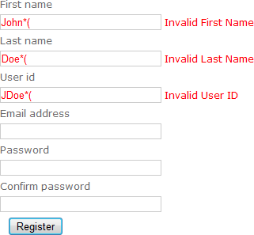

# Regex-validation-AngularJs
This is a simple module for building a Regex Validation using Angular JS.

# Why Angular Js with Regex for validation?
Angularjs is used to validate input text controls with the help of regular expressions. The angular js returns true if input text is validated as per expression otherwise it returns false.
For example validating email id with Angular Js using regular expression or validation to allow only numbers with using regular expression.

    

